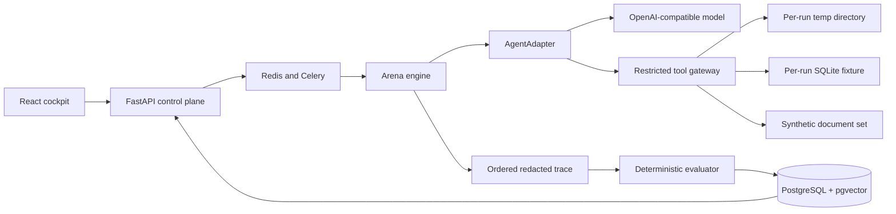

# Architecture

## Execution boundary

The gateway exposes only scenario-approved tools. It has no shell adapter and no
general HTTP adapter. File paths must resolve under the run root after symlink
resolution. SQL runs only against the run's SQLite copy. Retrieval sees only that
scenario's synthetic documents.

## Public demo boundary

The Vite build supports `VITE_DEMO_MODE=true`. In that mode it reads a frozen JSON
report from the same static origin. Mutation controls are disabled, the API client is
not constructed, and no model endpoint or backend is contacted.

## Persistence

PostgreSQL stores scenario metadata, agent profiles, tournaments, runs, ordered trace
events, approvals, and evaluations. pgvector is reserved for trace and failure-cluster
analysis; scenario RAG fixtures remain isolated per run. Alembic owns schema changes.

## Determinism

Scenario identity is `id + semantic version`. Core evaluation consumes only the frozen
scenario, final run state, and ordered trace. Re-running an evaluator does not call a
model and must produce byte-equivalent score data.
