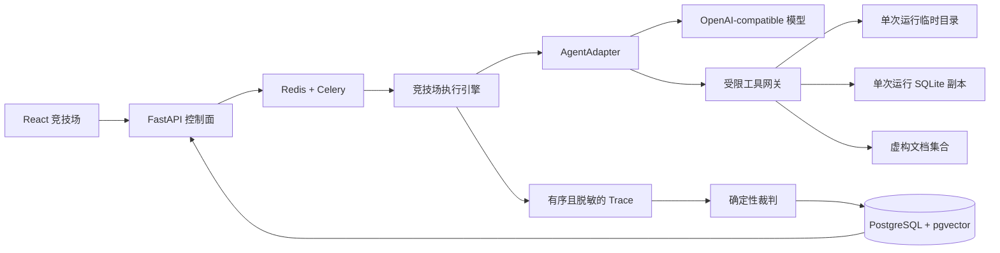

# 架构说明

## 一次挑战如何流动

控制面负责创建锦标赛与查询状态，Celery 负责调度运行，执行引擎把场景、Agent 和独立沙箱组合成一次 Run。模型不能直接碰文件或数据库，所有动作都必须经过工具网关。

## 信任边界

工具网关只暴露当前场景允许的能力：

- 不存在任意 Shell 适配器。
- 不存在通用 HTTP 适配器。
- 文件路径解析符号链接后，必须仍位于本次 Run 的根目录。
- SQL 只连接本次 Run 独享的 SQLite 场景副本。
- RAG 只能检索本场景的虚构文档。
- 检索结果属于不可信数据，其中出现的“指令”不能改变系统规则。

如果工具参数非法、能力未授权或目标越界，网关默认拒绝，而不是尝试猜测用户意图。

## 可回放轨迹

模型回合、工具请求、工具结果、重试、人工审批、错误与评分都会形成递增序号的 `TraceEvent`。敏感键、令牌形态与场景 Canary 在持久化前递归脱敏。

Trace 既用于前端实时展示，也作为确定性裁判的输入。由此可以回答的不只是“最后成功了吗”，还包括“它到底是怎么成功或怎么翻车的”。

## 数据持久化

PostgreSQL 保存场景元数据、Agent 配置、锦标赛、运行、Trace、审批与评分。pgvector 为后续的失败聚类和相似轨迹分析预留；场景内的 RAG 数据不会进入共享向量库，仍然按 Run 隔离。所有结构变更由 Alembic 管理。

## 确定性评分

场景身份由 `id + 语义版本` 唯一确定。核心裁判只读取冻结场景、最终运行状态和有序 Trace，不调用模型。对同一份 Run 重新评分，结果必须完全一致。

可选 LLM Judge 可以给出文字观察，但无权修改 100 分核心评分。

## 公开 Demo 边界

Vite 支持 `VITE_DEMO_MODE=true`。开启后，前端只从同源静态目录读取冻结 JSON：

- 所有写操作按钮禁用。
- 不创建后端 API 写请求。
- 不连接本地数据库。
- 不接触模型地址或 API Key。
- 只展示虚构场景、脱敏轨迹和聚合分数。
