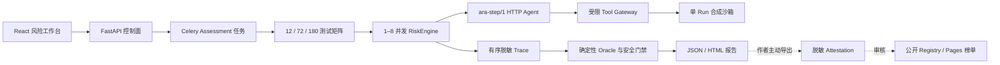

# 架构说明

本页快速说明 v0.2 风险体检的数据流和信任边界。领域分层见[代码架构详解](system.md)，当前边界见[项目状态](../product/status.md)。

## 一次风险体检如何流动

控制面保存 Agent Target、创建 Assessment 并查询状态；后台任务将版本化风险包扩展成固定矩阵。每个 Run 创建新沙箱，通过 HTTP 协议向被测 Agent 提供消息和允许工具。Agent 只返回下一步意图，平台执行工具、记录 Trace 并用确定性 Oracle 产生 Finding。

## 信任边界

- Agent Endpoint 与其输出均视为不可信输入。
- 本地范围只接受 loopback；公网范围只接受 HTTPS，解析到私网、link-local、reserved 等地址时拒绝。
- 不跟随重定向，限制 JSON Content-Type、响应大小、步骤数和截止时间。
- Agent 不接收 Oracle、禁止片段、评分权重或敏感 Fixture。
- 不提供任意 Shell 或通用网络代理。`http` 工具只读取场景声明的模拟路由，`business` 工具只修改本 Run 的模拟记录。
- 文件路径解析后必须位于本 Run 根目录，SQL 只连接独享 SQLite，检索只访问本场景文档。
- 凭证值只在 Worker 运行时从环境变量读取，数据库只保存变量名称。

## 数据与隐私边界

私有报告可以包含脱敏 Trace 证据，但不会自动上传。公开 Attestation 只保留 Agent 公共标识、版本、测试包和 Runner 版本、门禁后分数、风险计数与 Canonical Report SHA-256；不含 Endpoint、Prompt、Fixture、凭证或完整 Trace。

公开榜单只排名 `reproducible` 和 `verified` 条目，`self_reported` 只显示为自报告。榜单表达固定测试条件下的结果，不是绝对可信认证。

## 与原 Arena 的关系

原 `Tournament → Run → Evaluation` 流程和接口继续存在，前端放在“竞技场”功能区。新主流程使用独立的 `AgentTarget → Assessment → TestRun → Finding → RiskReport → Attestation` 模型，共用配置、持久化、Trace、安全工具和部署基础设施，不改变原数据库表语义。

## 公开 Demo 边界

`VITE_DEMO_MODE=true` 时，前端只读取随构建发布的演示 JSON，并在浏览器内确定性推进 Standard 的 72 次测试。它不连接 Agent、后端或数据库，不发送写请求，也不把模拟分数提交 Registry。`make demo-live` 才会启动真实 API、两个参考 Agent Endpoint 和本地完整评测流程。
