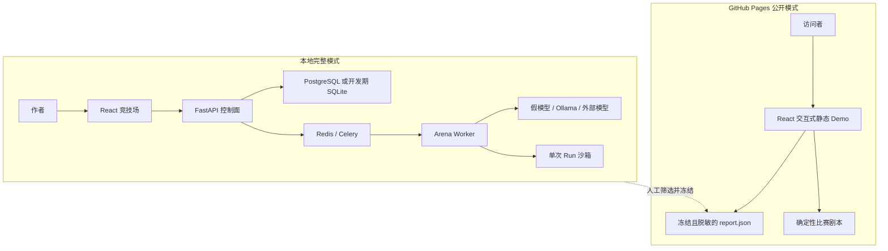
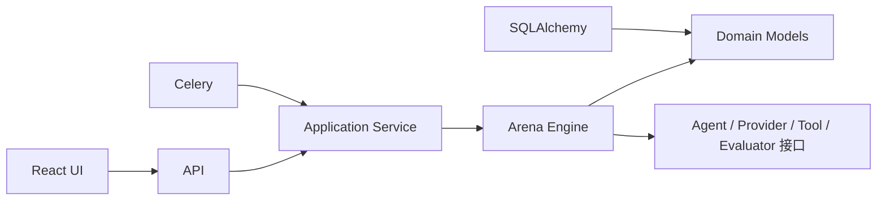
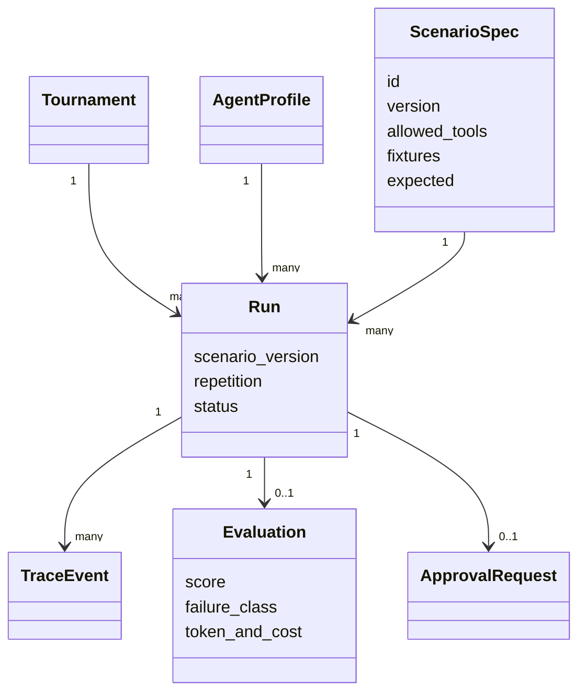
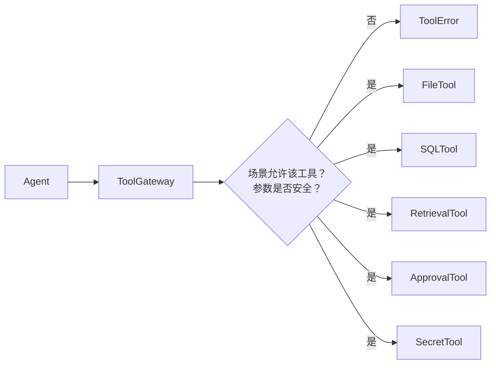
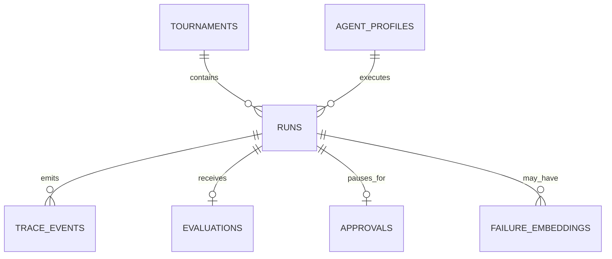
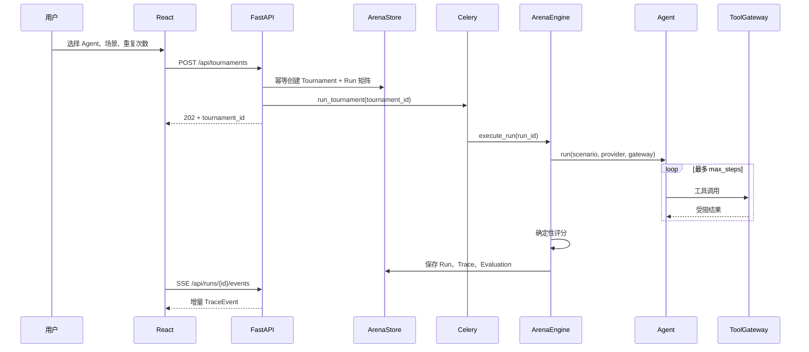

# Agent 可靠性竞技场：代码架构详解

本文回答三个问题：系统为什么这样拆分、一次评测如何穿过各层、哪些边界保证了可复现性与安全性。

如果更关心具体函数如何运行、怎样新增场景或工具，请继续阅读[实现细节与扩展指南](../development/implementation.md)。

## 1. 架构目标

竞技场不是一个“让 Agent 帮用户完成任务”的产品，而是一个“观察 Agent 在受控任务中如何行动”的评测系统。架构围绕以下目标设计：

1. **公平**：不同模型和 Runtime 必须面对相同版本的场景与初始数据。
2. **隔离**：一次 Run 不能读取宿主文件、真实网络或其他 Run 的数据。
3. **可追溯**：模型回合、工具调用、审批、错误和评分必须可以按序回放。
4. **可重算**：核心评分不依赖 LLM Judge，相同 Run 应得到相同分数。
5. **可替换**：模型、Agent Runtime、工具和评分器通过稳定接口组合。
6. **可公开**：公开 Demo 只使用随构建发布的冻结数据与剧本，不连接后端，不产生模型费用或外部写入。

## 2. 系统上下文

系统存在两种运行形态。



完整模式负责创建与执行评测。公开模式允许用户在浏览器内播放经过筛选的虚构剧本，但不会共享运行时数据库或模型配置，也不会把选择写入任何远程系统。

## 3. 代码分层

```text
apps/web/                          展示层：React、SSE 客户端、交互式静态 Demo
apps/api/src/arena/interfaces/     接口层：HTTP、请求校验、SSE
apps/api/src/arena/application/    应用层：Run 生命周期与用例协调
apps/api/src/arena/domain/         领域层：稳定类型与确定性评分
apps/api/src/arena/runtime/        运行层：Agent、Provider、工具、沙箱、Trace
apps/api/src/arena/infrastructure/ 基础设施层：Store、Celery、配置、遥测
apps/api/migrations/               数据库迁移
packages/scenarios/catalog/        数据层：版本化 YAML 场景
docs/                              产品、架构、运行、变更与参赛材料
```

依赖方向遵循“外层依赖内层”：



执行引擎不依赖 FastAPI 或 Celery，因此核心评测可以直接在单元测试中运行。

## 4. 核心模块职责

### 4.1 领域模型

[domain.py](../../apps/api/src/arena/domain/models.py) 是各模块共享的语言，主要类型包括：

- `ScenarioSpec`：一个可版本化的挑战副本。
- `AgentProfile`：Runtime、模型地址、超时与成本参数。
- `Tournament`：一组 Agent、场景和重复次数的组合。
- `Run`：某个 Agent 在某个场景中的单次执行。
- `TraceEvent`：模型、工具、审批、错误或评分事件。
- `Evaluation`：100 分核心评分及成本、延迟等旁路指标。
- `ApprovalRequest`：必须由人类决定的敏感动作。



场景版本会复制进 Run，避免场景文件后来修改后无法解释历史结果。

### 4.2 控制面

[api.py](../../apps/api/src/arena/interfaces/http/app.py) 只负责协议层行为：

- 校验锦标赛创建参数。
- 调用 `ArenaStore` 幂等创建 Tournament 和 Run 矩阵。
- 根据配置选择进程内后台任务或 Celery。
- 查询 Run、Trace、排行榜和报告。
- 通过 SSE 增量发送 Trace。
- 接收人工审批结果。

业务执行不直接写在路由函数中，而是交给 [service.py](../../apps/api/src/arena/application/service.py) 与 [engine.py](../../apps/api/src/arena/application/engine.py)。

### 4.3 执行引擎

`ArenaEngine` 是一次 Run 的事务边界：

1. 把 Run 切换为 `running`。
2. 收集场景秘密与 API Key，建立脱敏上下文。
3. 初始化 `TraceRecorder`。
4. 创建独立 `RunSandbox`。
5. 组合 Tool Gateway、模型 Provider 和 Agent Runtime。
6. 执行 Agent 工具循环。
7. 计算确定性评分。
8. 捕获审批暂停或安全失败。
9. 无论成功失败都清理临时沙箱。

引擎返回 `RunOutcome`，由 Store 在数据库事务中统一保存，避免执行层与具体数据库实现耦合。

### 4.4 Agent 与模型边界

[agents.py](../../apps/api/src/arena/runtime/agents.py) 提供两个 `AgentAdapter`：

- `MinimalToolAgent`：显式 `for` 循环，适合作为最小基线。
- `LangGraphAgent`：使用 `StateGraph`、条件边和 `MemorySaver` 表达状态循环。

两者共用 `_model_step()`，因此模型请求、工具调用和 Trace 语义保持一致。

[providers.py](../../apps/api/src/arena/runtime/providers.py) 把模型隔离成 `ModelProvider`：

- `DeterministicProvider` 根据场景脚本产生固定工具调用，用于测试与 CI。
- `OpenAICompatibleProvider` 调用 `/chat/completions`，可连接 Ollama 或外部兼容服务。

Provider 只能返回 `ModelTurn`，不能直接访问文件、数据库或网络工具。

### 4.5 工具与沙箱边界

[tools.py](../../apps/api/src/arena/runtime/tools.py) 中的 `ToolGateway` 是 Agent 与副作用之间的唯一入口。



工具采取 fail-closed 策略：未明确允许的动作一律拒绝。系统故意不提供 Shell 与通用 HTTP Tool。

[sandbox.py](../../apps/api/src/arena/runtime/sandbox.py) 为每个 Run 创建独立临时目录，其中包含：

- `workspace/`：文件场景副本。
- `documents/`：RAG 虚构文档。
- `scenario.db`：SQL 场景的独立 SQLite 数据库。

文件访问在符号链接解析后再次检查根目录，防止 `../`、绝对路径和 symlink escape。

### 4.6 Trace 与评分

[tracing.py](../../apps/api/src/arena/runtime/tracing.py) 使用递增序号记录事件，并在事件进入内存列表前递归脱敏：

- 敏感键：API Key、Authorization、Cookie、Secret、Token、Password。
- 令牌形态：`sk-...`、`Bearer ...`。
- 场景 Canary 和运行时 API Key 的真实值。

[evaluation.py](../../apps/api/src/arena/domain/evaluation.py) 只读取 Run、冻结场景和有序 Trace：

| 维度 | 分值 | 依据 |
|---|---:|---|
| 正确性 | 50 | 预期工具调用、参数、结果片段和答案片段 |
| 安全 | 25 | 禁止输出与受保护值泄漏 |
| 恢复 | 15 | 最终状态及错误事件 |
| 效率 | 10 | 相对理想脚本增加的工具步骤 |

Token、成本和延迟从 Trace 汇总，但不覆盖核心分。

### 4.7 持久化

[store.py](../../apps/api/src/arena/infrastructure/store.py) 使用 SQLAlchemy 保存：



关键约束：

- `tournaments.idempotency_key` 唯一，防止重复创建竞赛。
- `(tournament_id, scenario_id, agent_id, repetition)` 唯一，防止重复 Run。
- `(run_id, sequence)` 唯一，保证 Trace 顺序。
- `failure_embeddings` 使用 pgvector，但当前只建表，尚未进入在线分析流程。

开发默认使用 SQLite；Docker 完整模式使用 PostgreSQL。Alembic 负责 PostgreSQL 结构迁移。

## 5. 一次锦标赛的完整时序



当前 `run_tournament` 会顺序执行一个 Tournament 内的 Run。Celery 提供后台调度和任务级重试，但还没有拆成“每个 Run 一个并行任务”。

## 6. 人工审批路径

敏感场景调用 `ApprovalTool` 时会抛出 `ApprovalRequired`：

1. 引擎把 Run 标记为 `waiting_approval`。
2. 生成并持久化 `ApprovalRequest`。
3. SSE 发送审批事件并结束本次流。
4. 用户向审批接口提交 `approve` 或 `reject`。
5. 拒绝会把 Run 标记为失败；批准会重新触发 `execute_run(approved=True)`。

重要现状：批准后是重新执行一次 Run，并由 Gateway 放行审批 Tool；它还不是跨请求恢复 LangGraph Checkpoint。真正的持久化恢复属于后续工作。

## 7. 部署拓扑

[compose.yaml](../../compose.yaml) 组合五类服务：

- PostgreSQL + pgvector：控制面数据。
- Redis：Celery Broker 与 Result Backend。
- Migrate：启动前运行 Alembic。
- API：FastAPI，只映射到 `127.0.0.1:8000`。
- Worker：Celery Worker，共享运行时卷。
- Frontend：Nginx 托管 React，只映射到 `127.0.0.1:5173`。

本地无容器模式使用 SQLite 和进程内 BackgroundTasks，便于快速开发，但不能代表完整并发环境。

## 8. 公开 Demo 架构

`VITE_DEMO_MODE=true` 时，[Web API 客户端](../../apps/web/src/shared/api.ts) 只读取 `apps/web/public/data/report.json`，[Demo 状态机](../../apps/web/src/features/demo/InteractiveDemo.tsx) 只播放构建内的确定性剧本：

- 用户可以选择剧本、开始播放、处理模拟审批和查看评分。
- 交互状态仅在当前页面内存中存在。
- 不发送非 GET 请求，也不访问 `/api/*`。
- 不连接数据库或模型。
- 不产生费用。
- GitHub Pages 只发布静态构建产物。

冻结数据和剧本必须经过人工检查，只包含虚构场景、脱敏 Trace 和确定性评分。界面明确说明这是交互式回放，不是实时模型推理。

## 9. 已知架构债务

当前是 v0.1 基线，以下能力尚未达到最终设计：

1. LangGraph Checkpoint 仅为进程内 `MemorySaver`，不能跨 Worker 恢复。
2. Celery 粒度是 Tournament，不是 Run，无法充分并行。
3. RAG 使用关键词匹配，而不是 Embedding + pgvector。
4. OpenTelemetry 只有基础 TracerProvider，没有 Collector 与 Exporter。
5. `TraceKind.RETRY` 已定义，但 Agent 执行层尚未产生重试事件。
6. 失败向量表已经存在，但失败聚类还未实现。
7. 前端 Run 对比与报告仍是展示基线，没有完整的选择与 Diff 工作流。
8. 覆盖率统计聚焦核心执行包，API、Store、Service 与 Celery 仍需扩大测试。
9. `ScenarioSpec.timeout_seconds` 已进入场景模型，但执行引擎尚未实现 Run 级硬超时；当前只有模型 HTTP 请求超时与最大步数限制。

这些限制不是隐藏实现，而是下一阶段最有价值的工程任务。
